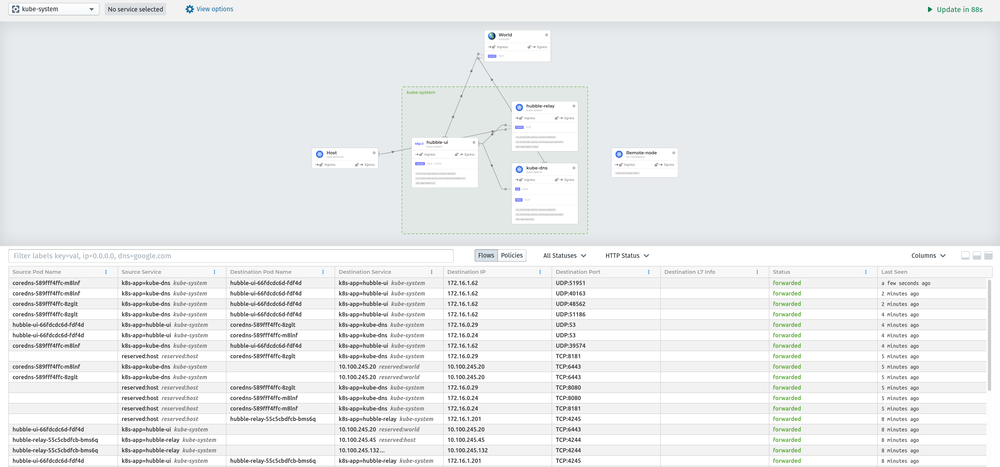

# Kubernetes The Hard Way The Easy Way...

Creates a Single Master Kubernetes cluster using [multipass](https://github.com/canonical/multipass) and [cilium](https://docs.cilium.io/en/stable/gettingstarted/k8s-install-default/#install-cilium)

All scripts are available to learn how it is built.

# Specs

- Kubernetes 1.23.4
- etcd 3.5.2
- containerd 1.6.0
- cni plugins 1.0.1
- cilium 1.11.1 (via helm chart)
- coredns 1.8.7 (via helm chart)

# Requirements

- [tmux](https://github.com/tmux/tmux)
  - [How to run commands in parallel with tmux](https://github.com/kelseyhightower/kubernetes-the-hard-way/blob/master/docs/01-prerequisites.md#running-commands-in-parallel-with-tmux)
  - Install
    - linux: `apt install tmux` # or yum/dnf/pacman
    - mac: `brew install tmux`
- helm 3+
  - linux: [here](https://helm.sh/docs/intro/install/)
  - mac: `brew install helm`
- ipcalc
  - linux: `apt install ipcalc`
  - mac: `brew install ipcalc`
- [multipass](https://github.com/canonical/multipass)
  - linux: `sudo snap install multipass --classic`
  - mac: `brew cask install multipass`
- `cfssl` and `cfssljson`
  - linux:
```shell
wget -q --show-progress --https-only --timestamping \
  https://storage.googleapis.com/kubernetes-the-hard-way/cfssl/linux/cfssl \
  https://storage.googleapis.com/kubernetes-the-hard-way/cfssl/linux/cfssljson
chmod +x cfssl cfssljson
sudo mv cfssl cfssljson /usr/local/bin/
```
  - mac: `brew install cfssl`
- `kubectl`
  - linux:
```shell
wget https://storage.googleapis.com/kubernetes-release/release/v1.18.5/bin/linux/amd64/kubectl
chmod +x kubectl
sudo mv kubectl /usr/local/bin/
```
  - mac:
```shell
curl -o kubectl https://storage.googleapis.com/kubernetes-release/release/v1.18.5/bin/darwin/amd64/kubectl
chmod +x kubectl
sudo mv kubectl /usr/local/bin/
```

# Procedure

1. Create your machines:

```shell
$ ./setup.sh
```

2. Wait a couple of minutes for cilium and coredns to start working

```shell
$ kubectl get all --all-namespaces
ACE     NAME                                   READY   STATUS    RESTARTS   AGE
kube-system   pod/cilium-lc9bf                       1/1     Running   0          2m28s
kube-system   pod/cilium-operator-657978fb5b-jp8cb   1/1     Running   0          2m28s
kube-system   pod/cilium-s998c                       1/1     Running   0          2m26s
kube-system   pod/coredns-589fff4ffc-5nvxb           1/1     Running   0          2m27s
kube-system   pod/coredns-589fff4ffc-m5kgm           1/1     Running   0          2m27s

NAMESPACE     NAME                 TYPE        CLUSTER-IP    EXTERNAL-IP   PORT(S)                  AGE
default       service/kubernetes   ClusterIP   172.17.0.1    <none>        443/TCP                  4m13s
kube-system   service/kube-dns     ClusterIP   172.17.0.10   <none>        53/UDP,53/TCP,9153/TCP   2m27s

NAMESPACE     NAME                    DESIRED   CURRENT   READY   UP-TO-DATE   AVAILABLE   NODE SELECTOR   AGE
kube-system   daemonset.apps/cilium   2         2         2       2            2           <none>          2m28s

NAMESPACE     NAME                              READY   UP-TO-DATE   AVAILABLE   AGE
kube-system   deployment.apps/cilium-operator   1/1     1            1           2m28s
kube-system   deployment.apps/coredns           2/2     2            2           2m27s

NAMESPACE     NAME                                         DESIRED   CURRENT   READY   AGE
kube-system   replicaset.apps/cilium-operator-657978fb5b   1         1         1       2m28s
kube-system   replicaset.apps/coredns-589fff4ffc           2         2         2       2m27s
```

3. Your cluster is ready, lets verify data encryption works

```shell
$ kubectl create secret generic kubernetes-the-hard-way --from-literal="mykey=mydata"
$ multipass exec master-k8s -- sudo ETCDCTL_API=3 etcdctl get --endpoints=https://127.0.0.1:2379 --cacert=/etc/etcd/ca.pem --cert=/etc/etcd/kubernetes.pem --key=/etc/etcd/kubernetes-key.pem /registry/secrets/default/kubernetes-the-hard-way | hexdump -C
00000000  2f 72 65 67 69 73 74 72  79 2f 73 65 63 72 65 74  |/registry/secret|
00000010  73 2f 64 65 66 61 75 6c  74 2f 6b 75 62 65 72 6e  |s/default/kubern|
00000020  65 74 65 73 2d 74 68 65  2d 68 61 72 64 2d 77 61  |etes-the-hard-wa|
00000030  79 0a 6b 38 73 3a 65 6e  63 3a 61 65 73 63 62 63  |y.k8s:enc:aescbc|
00000040  3a 76 31 3a 6b 65 79 31  3a 61 bb c0 45 f2 df 88  |:v1:key1:a..E...|
00000050  36 46 05 df c1 df 26 e1  e0 59 18 9f 7d 51 7a d9  |6F....&..Y..}Qz.|
00000060  28 0d 03 4e c3 14 55 01  51 d6 aa cc 50 21 a5 09  |(..N..U.Q...P!..|
00000070  86 92 89 9b 33 82 43 09  7d 5b fe bb 68 45 43 48  |....3.C.}[..hECH|
00000080  96 9a 1e a8 88 30 82 a8  2c d8 26 ea 12 19 58 da  |.....0..,.&...X.|
00000090  3a 25 ed 6b 47 1f e2 e9  31 91 e6 cf 64 bb 19 41  |:%.kG...1...d..A|
000000a0  fe 2b 7a 86 a8 be e4 c0  b6 98 2e dc 96 92 58 92  |.+z...........X.|
000000b0  c4 6b c1 85 a9 d0 ec d6  03 2d c7 2c 14 f5 da 03  |.k.......-.,....|
000000c0  ef c6 c9 2b bc 26 9c 36  ab 0c da 08 f2 8b 79 c7  |...+.&.6......y.|
000000d0  12 98 55 5f 4c 56 f7 fd  e1 71 45 16 a3 59 01 76  |..U_LV...qE..Y.v|
000000e0  97 5b d1 cc 91 92 c5 d9  05 0a                    |.[........|
000000ea
```

The etcd key should be prefixed with `k8s:enc:aescbc:v1:key1`, which indicates the `aescbc` provider was used to encrypt the data with the `key1` encryption key.

4. [Deployments](https://github.com/kelseyhightower/kubernetes-the-hard-way/blob/master/docs/13-smoke-test.md#deployments) as they are described on Kubernetes the hard way will work

5. NodePort service will work in the following way (Depends on step 10)

```shell
$ kubectl expose deployment nginx --port 80 --type NodePort
$ NODE_PORT=$(kubectl get svc nginx --output=jsonpath='{range .spec.ports[0]}{.nodePort}')
$ WORKER_IP=$(multipass info 'worker-1-k8s' | grep 'IPv4' | awk '{ print $2 }')
$ curl -I "http://${WORKER_IP}:${NODE_PORT}"
HTTP/1.1 200 OK
Server: nginx/1.19.0
Date: Fri, 10 Jul 2020 04:18:52 GMT
Content-Type: text/html
Content-Length: 612
Last-Modified: Tue, 26 May 2020 15:00:20 GMT
Connection: keep-alive
ETag: "5ecd2f04-264"
Accept-Ranges: bytes
```

6. You've done a kubernetes!

# How to see hubble-ui

1. Forward hubble-ui port

```shell
$ POD_NAME=$(kubectl get pods -n kube-system -l k8s-app=hubble-ui -o jsonpath="{.items[0].metadata.name}")
$ kubectl port-forward -n kube-system ${POD_NAME} 8080:12000
```

2. In your browser go to [http://localhost:8080](http://localhost:8080) -> pick a namespace with pods. Example below:



# Troubleshooting

## All nodes should be able to reach each other via hostname

01-config-files/distribute-config-files.sh generates multipass-hosts and later the bootstrap scripts append it to /etc/hosts on the masters and workers

# Related links
- [kelseyhightower/kubernetes-the-hard-way](https://github.com/kelseyhightower/kubernetes-the-hard-way)
- [multipass /etc/hosts](https://github.com/canonical/multipass/issues/853#issuecomment-630097263)
- <https://www.youtube.com/playlist?list=PLC6M23w-Wn5mA_bomV6YVB5elNw7IsHt5>
